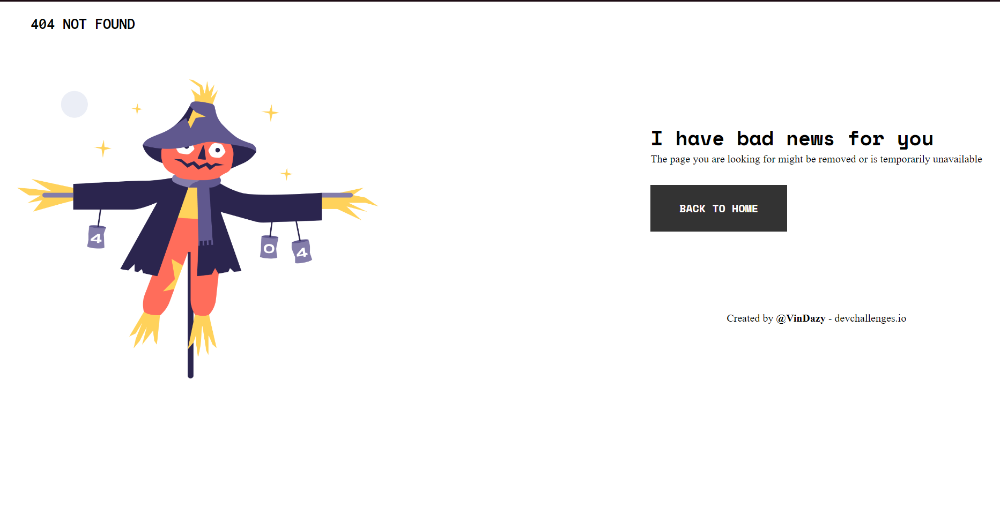

<!-- Please update value in the {}  -->

<h1 align="center">{404 Not Found Page}</h1>

   Solution for a challenge from  <a href="http://devchalxlenges.io" target="_blank">Devchallenges.io</a>.

  <h3>
    <a href="https://{https://devchallenges.io/paths/responsive-web-developer/solutions}">
      Demo
    </a>
     | 
    <a href="https://{https://vindazy.github.io/404-Not-Found-Challenge/}">
      Solution
    </a>
     | 
    <a href="https://devchallenges.io/challenges/wBunSb7FPrIepJZAg0sY">
      Challenge
    </a>
  </h3>

<!-- TABLE OF CONTENTS -->

## Table of Contents

- [Overview](#overview)
  - [Built With](#built-with)
- [Features](#features)
- [Contact](#contact)
- [Acknowledgements](#acknowledgements)

<!-- OVERVIEW -->

## Overview

  
Introduce your projects by taking a screenshot or a gif. Try to tell visitors a story about your project by answering:

- Where can I see your demo?
  I have attached above a screenshot of the project website 
- What was your experience?
  My experience was self explanatory , i watched youtube tutorials and read the course provided by our tutor 
- What have you learned/improved?
  My understanding of CSS and HTML basics 
- Your wisdom? :)
  Never hesitate to take the first step 

### Built With

<!-- This section should list any major frameworks that you built your project using. Here are a few examples.-->

- [HTML]
- [CSS]

## Features

<!-- List the features of your application or follow the template. Don't share the figma file here :) -->

This application/site was created as a submission to a [DevChallenges](https://devchallenges.io/challenges) challenge. The [challenge](https://devchallenges.io/challenges/wBunSb7FPrIepJZAg0sY) was to build an application to complete the given user stories.

## Acknowledgements

<!-- This section should list any articles or add-ons/plugins that helps you to complete the project. This is optional but it will help you in the future. For exmpale -->
- [Project manager/tutor : Raed Bahri ](https://www.linkedin.com/in/raed-bahri/)
## Contact
- GitHub [@VinDazy](https://{https://github.com/VinDazy})
- LinkedIn [@khalyl-ebdelli](https://{https://www.linkedin.com/in/khalyl-ebdelli-3733ab1ba/})
